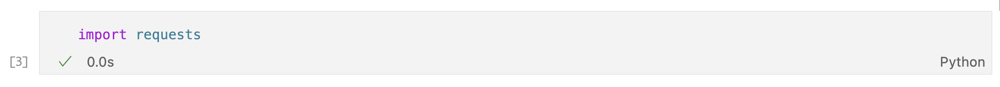
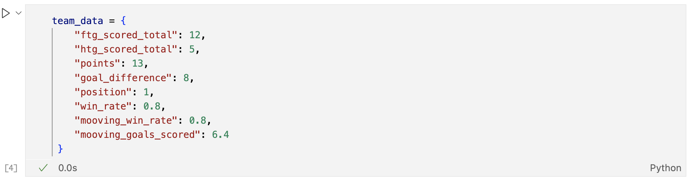
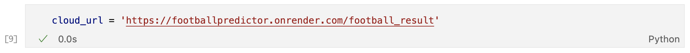
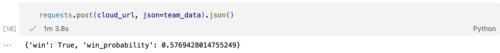

# Midterm project: Football predictor


## Problem description

As a football fan, the most interesting thing in the world is football, and there has always been one desire __"to predict the outcome of a football match and find the secret ingredients to determine which team will be better"__. 

The goal is to find the best way to predict a football match and also, understand which are the most important ingredients in order to determine which team is the winner. Even if the prediction can be done in two different ways, the winner of the match or the amount of goals by each team. The focus of this project will be to determine the winner of the match.


## Data

[Data information](https://github.com/sergioasb8/midterm_project/blob/main/data/data.md)


## Use the project locally on your computer

### Setup

Following the links, there is more detailed information about the required technologies where you can find information to download and how to use them.

[Python](https://www.python.org/) Python 3.11 is the recommended version.

[Docker](https://www.docker.com/)

### Clone the repository

On the cmd move to the folder where you want to save the repository and type

```bash
 git clone https://github.com/sergioasb8/midterm_project.git
```

### Virtual Enviroment

1. As mentioned during the setup, make sure you have Python 3.11 installed.

2. Using the cmd or the terminal go to the project repository folder, it should appear inside the folder where you clone the repository.

3. Install ```pipenv```

```bash
    pip3 install pipenv
```

4. Use pipenv to install the required packages from the **Pipfile** and create the virtual environment.

```bash
    pipenv install
```

5. Activate the virtual environment.

```bash
    pipenv shell
```


### Run locally

1. Run the Flask application using gunicorn.

```bash
    gunicorn --bind 0.0.0.0:9696 predict:app
```

Once all this steps are followed correctly the Flask application will be available at ```http://0.0.0.0:9696```.

2. Use the service, you can use the notebook [08_test_service.ipynb](https://github.com/sergioasb8/midterm_project/blob/main/notebooks/08_test_service.ipynb) to check how to use the service.


## Build and run the container

### Build the Image

For this step, Docker will be creating the Image with the **Dockerfile** file.

1. Type on the terminal or cmd

```bash
    docker build -t midterm-project .
```

Where midterm-project will be the name of the Image and the "." will indicate to run the dockerfile that is inside the current folder.

2. Check that the Image was create.

```bash
    docker images
```

this will display a list of all the images, **midterm-project** should be in that list.

### Run locally

1. Run the Flask application using the docker image.

```bash
    docker run -it --rm -p 9696:9696 midterm-project
```

Once all this steps are followed correctly the Flask application will be available at ```http://0.0.0.0:9696```.

2. Use the service, you can use the notebook [08_test_service.ipynb](https://github.com/sergioasb8/midterm_project/blob/main/notebooks/08_test_service.ipynb) to check how to use the service.


## Use the cloud service

### Setup

Using a Jupyter Notebook is recommended since it allows to see the output after a cell is run.

check the kernel already have installed **requests**.

```python
    !pip3 freeze
```

If requests does not apear on the list of installed libraries type

```python
    !pip3 install requests
```

### Make a request to the deployed service

1. Import requests



2. Create a json with all the required info to make a prediction



3. Define the url to the deployed service



4. Make the request



Also use the notebook [08_test_service.ipynb](https://github.com/sergioasb8/midterm_project/blob/main/notebooks/08_test_service.ipynb) to check how to use the service.
